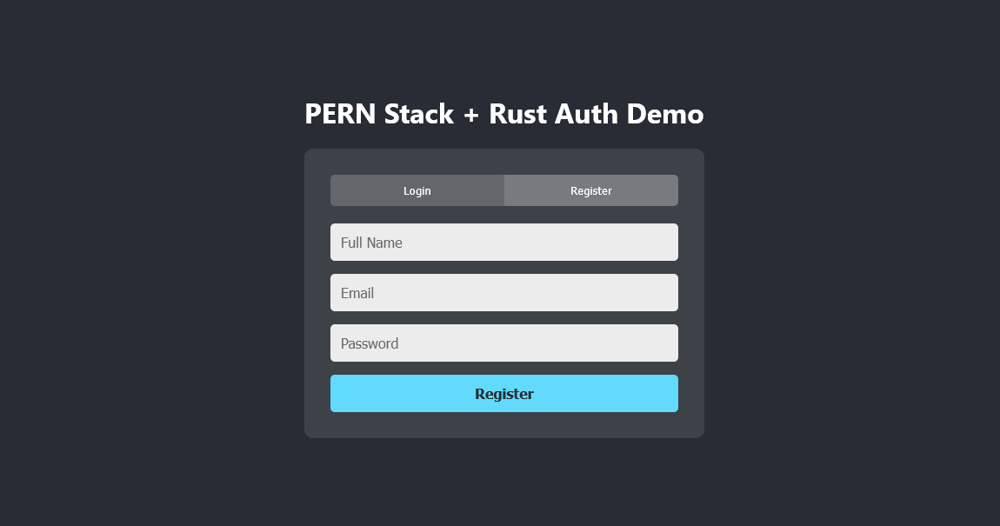
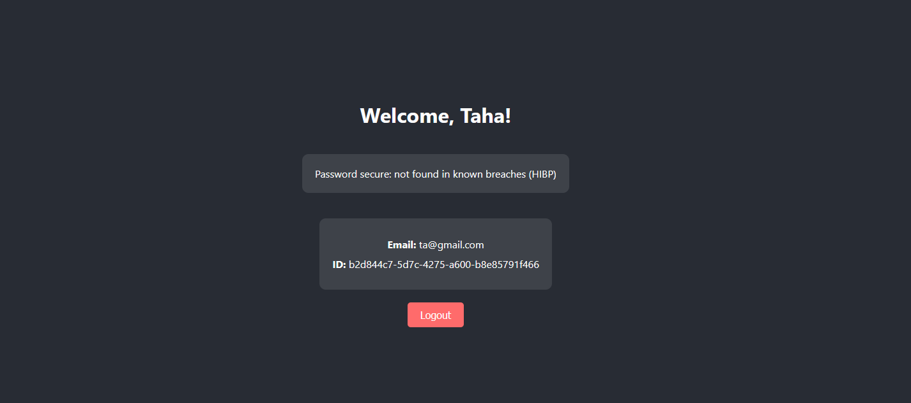

# Full-Stack Authentication Platform with Rust Integration

A modern full-stack application for user management, including registering and logging in with email + password. Node.js + Express backend with PostgreSQL database and React frontend written in TypeScript,  also featuring high-performance password security analysis and hashing via Rust, and password breach checking via the HIBP (Have I Been Pwned) API. Docker containerization and orchestration included.

## Features

- **JWT Authentication**: Secure token-based authentication with protected routes
- **Password Security Analysis**: CPU-intensive cryptographic operations handled by Rust for 10-50x speedup
  - Entropy calculation
  - Pattern analysis (repeated characters, sequential patterns, strength scoring)
  - Argon2 hashing
- **React Frontend**: Modern UI development with TypeScript
- **Modern Database**: User data and password hashes secured in PostgreSQL database
- **Have I Been Pwned**: Cloud service for checking if passwords have been leaked
- **Production Ready**: CORS, REST, ACID

## Screenshots



## Performance Comparisons

### Password Hashing Performance Benchmark

#### 100 passwords:

Node bcrypt (10 rounds):       5.10s\
Node Argon2:                   4.39s\
Rust Argon2 (sequential):      1.61s\
Rust Argon2 (parallel):        0.56s\
Rust parallel speedup: 2.89x faster than sequential, 7.86x faster than Node

#### 1000 passwords:

Node bcrypt (10 rounds):       50.20s\
Node Argon2:                   44.29s\
Rust Argon2 (sequential):      16.12s\
Rust Argon2 (parallel):        5.57s\
Rust parallel speedup: 2.89x faster than sequential, 7.95x faster than Node

Key Insights: Rust parallel processing shows ~8.0x speedup for batch operations

## Prerequisites

- Node.js 18+ 
- Rust toolchain (rustc, cargo) (may need Visual Studio Build Tools for Windows development)
- npm or yarn
- Git
  
## Setup Instructions

### 1. Clone Repository

```bash
git clone https://github.com/t7aziz/fullstack-user-auth-app.git
cd fullstack-user-auth-app
```

### 2. Environment Variables

Copy the `.env.example` file to a new `.env` file and fill in the needed variables:

```env
DB_USER=
DB_HOST=
DB_DATABASE=
DB_PASSWORD=
DB_PORT=
PORT=3000
JWT_SECRET=
```

### 3. Run with Docker

```bash
docker-compose up --build
```

### 4. (Alternative to Docker) Install Locally and Run

#### Install Rust

**Windows:**
Download and run https://rustup.rs/ (rustup-init.exe)

**macOS/Linux:**
```bash
curl --proto '=https' --tlsv1.2 -sSf https://sh.rustup.rs | sh
```

Also add .cargo/bin to your PATH

#### Install Dependencies and build

```bash
npm run install:all
npm run build
```

#### Run

```bash
npm run dev
```

This starts:
- Backend API on http://localhost:3000
- Frontend on http://localhost:3001

##### Production Mode

```bash
npm start
```

## WIP 

- [ ] Rate limiting with Redis
- [✓] Docker containerization
- [ ] SHA for hashing large files using Rust
- [ ] Deploy to some domain

## License

MIT

## Author

Taha Aziz - [GitHub Profile](https://github.com/t7aziz)
